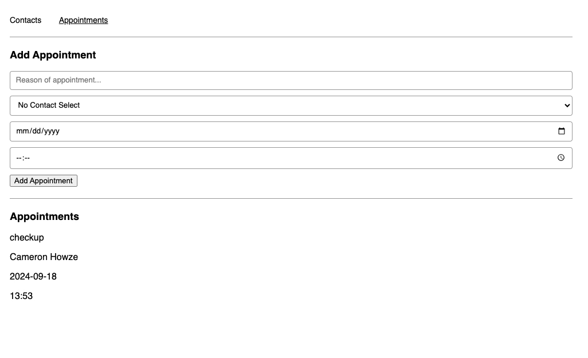

# Appointment Planner

## Table of contents

- [Overview](#overview)
  - [The challenge](#the-challenge)
  - [Screenshot](#screenshot)
  - [Links](#links)
- [My process](#my-process)
  - [Built with](#built-with)
  - [What I learned](#what-i-learned)
  - [Continued development](#continued-development)
- [Author](#author)

## Overview

### The challenge

Users should be able to:

- View the optimal layout for the app depending on their device's screen size
- Under the Contacts tab, input contact information.
- Contact information will be added to the contact list below.
- Duplicate contacts are prevented.
- Under the Appointments tab, input appointment information.
- Can select contact from contact list and add to appointent information.
- Appointment information will be added to the appointment list below

### Screenshot

### Links

- Live Site URL: [View](https://appointmentplannerstartingv18.netlify.app/)

## My process

- Implement both stateful and stateless React components.
- The main `App` component will manage the state for contacts and appointments, providing callback functions to child components to update these arrays.
- `ContactsPage` will handle adding new contacts by keeping track of form input values and preventing duplicates, while `AppointmentsPage` will handle new appointments, linking them to contacts.
- You'll also build `ContactForm` and `AppointmentForm` as stateless components to render forms and manage user input, and the `TileList` will display lists of contacts or appointments using reusable `Tile` components.
- Lastly, `ContactPicker` will allow users to select contacts from a dropdown list for appointments.
- This structure ensures efficient state management and separation of logic across different components.

### Built with

- Semantic HTML5 markup
- CSS custom properties
- Mobile-Responsive Design
- JavaScript - Scripting language
- [React](https://reactjs.org/) - JS library

### What I learned

This was a class project to test my skills with Reactjs.

### Continued development

maybe use later

## Author

- Website - [Cameron Howze](https://camkol.github.io/)
- Frontend Mentor - [@camkol](https://www.frontendmentor.io/profile/camkol)
- GitHub- [@camkol](https://github.com/camkol)
- LinkedIn - [@cameron-howze](https://www.linkedin.com/in/cameron-howze-28a646109/)
- E-Mail - [cameronhowze4@outlook.com](mailto:cameronhowze4@outlook.com)
